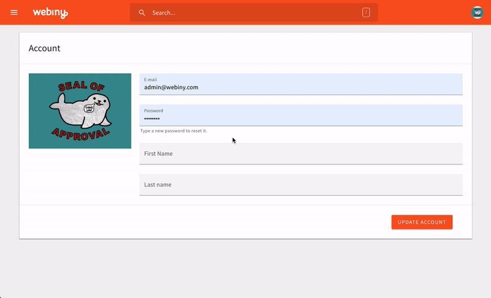
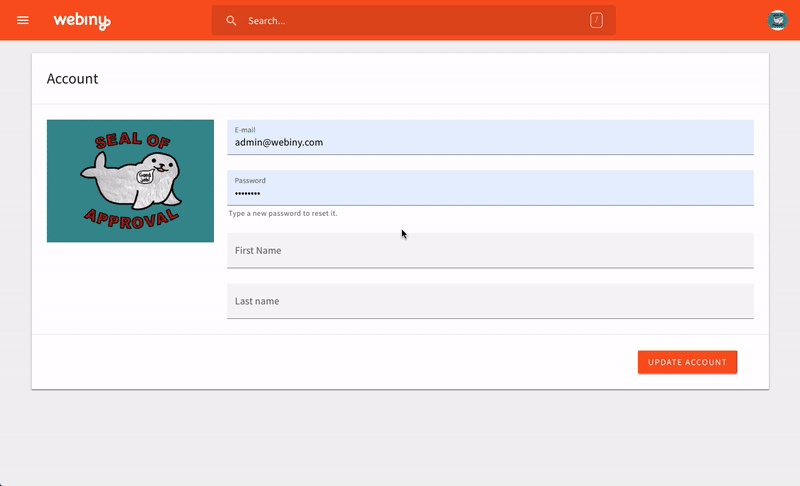

# ⌨ react-hotkeyz
[](https://travis-ci.org/doitadrian/react-hotkeyz)
[](https://coveralls.io/github/doitadrian/react-hotkeyz?branch=master)
[](https://www.npmjs.com/package/react-hotkeyz) 
[](https://www.npmjs.com/package/react-hotkeyz)

[](https://github.com/prettier/prettier)
[](#contributors)
[](http://makeapullrequest.com)
  
A component that enables registration of hotkeys per z-index. 

Before:



With `react-hotkeyz`:



## Install
```
npm install --save react-hotkeyz
```

Or if you prefer yarn: 
```
yarn add react-hotkeyz
```

## Quick Example:
🤞
 
```javascript
import { useHotkeys, Hotkeys } from "react-hotkeyz";
```

More examples on https://react-hotkeyz.netlify.com.

## Additional information
1. Only listeners from current z-index are triggered
2. Uses `is-hotkey` lib
3. Only one key press listener is registered
4. When there are no active callbacks, event listener is completely removed 
5. When trying to register the same shortcut on the same z-index, an error will be thrown
6. Can be used as a hook or a HOC

## Contributors

Thanks goes to these wonderful people ([emoji key](https://github.com/kentcdodds/all-contributors#emoji-key)):

<!-- ALL-CONTRIBUTORS-LIST:START - Do not remove or modify this section -->
<!-- prettier-ignore -->
| [<br /><sub><b>Adrian Smijulj</b></sub>](https://github.com/doitadrian)<br />[💻](https://github.com/doitadrian/react-hotkeyz/commits?author=doitadrian "Code") [📖](https://github.com/doitadrian/react-hotkeyz/commits?author=doitadrian "Documentation") [💡](#example-doitadrian "Examples") [👀](#review-doitadrian "Reviewed Pull Requests") [⚠️](https://github.com/doitadrian/react-hotkeyz/commits?author=doitadrian "Tests") |
| :---: |
<!-- ALL-CONTRIBUTORS-LIST:END -->

This project follows the [all-contributors](https://github.com/kentcdodds/all-contributors) specification. Contributions of any kind welcome!
